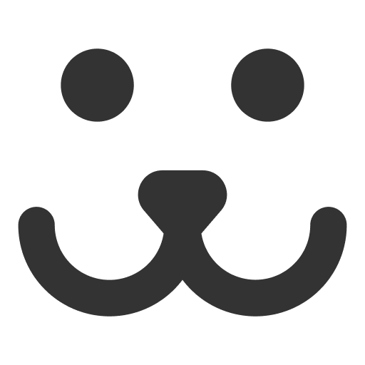

<p align="center">
  

  

   
  <a href="https://github.com/matheus-calixto-silva/dogs/commits/main">
    
  </a>
    
   

  <a href="https://www.linkedin.com/in/matheus-calixto-silva/">
    
  </a>
  
</p>

<h1 align="center">
    
</h1>

<h4 align="center"> 
	🐶  Dogs - Concluído  🐶
</h4>

<p align="center">
 <a href="#-sobre-o-projeto">Sobre</a> •
 <a href="#-layout">Layout</a> • 
 <a href="#-como-executar-o-projeto">Como executar</a> • 
 <a href="#-tecnologias">Tecnologias</a> • 
 <a href="#-autor">Autor</a> • 
 <a href="#-licença">Licença</a>
</p>


## 💻 Sobre o projeto

Dogs - é um site feito para que pessoas possam postar fotos de seus cães e interagir com outros donos de pets.


O projeto foi desenvolvido durante o curso **React Completo** da [Origamid](https://www.origamid.com/).
A Origamid é uma plataforma online com aulas ministradas pelo professor André Rafael.

---

## 🎨 Layout


### Mobile

https://user-images.githubusercontent.com/56086100/194737736-47cb3274-049b-459f-91c4-7ff4dd17e99f.mp4


### Web

https://user-images.githubusercontent.com/56086100/194737766-adfa7bf3-18f5-45e5-8950-4bb7bf404ee0.mp4

---

## 🚀 Como executar o projeto

Este projeto é composto apenas pelo Frontend.

### Pré-requisitos

Antes de começar, você vai precisar ter instalado em sua máquina
-   **[Git](https://git-scm.com)**
-   **[NodeJS](https://nodejs.org/en/)**
-   **[Yarn](https://yarnpkg.com/)**

Em caso de dúvidas parte deste tutorial da [Rocketseat](https://react-native.rocketseat.dev/), pode ajudar bastante.
Além disto é bom ter um editor para trabalhar com o código como [VSCode](https://code.visualstudio.com/)

```bash
    # Para clonar o repositório use o comando abaixo em seu terminal
    $ git clone git@github.com:matheus-calixto-silva/dogs.git
```

#### 🧭 Rodando a aplicação

Abra o terminal na pasta do projeto e execute os comandos abaixo em ordem:

```bash
    # Instalação de dependências
    $ yarn install
    
    # Rodar o projeto
    $ yarn dev
```

---

## 🛠 Tecnologias

As seguintes ferramentas foram usadas na construção do projeto:

#### **Website**

-   **[React](https://pt-br.reactjs.org/)**
-   **[Vite](https://vitejs.dev/)**
-   **[Javascript](https://developer.mozilla.org/pt-BR/docs/Web/JavaScript)**


#### [](https://github.com/tgmarinho/Ecoleta#utilit%C3%A1rios)**Utilitários**

-   Editor:  **[Visual Studio Code](https://code.visualstudio.com/)**

---

## 🦸 Autor

<a href="https://www.linkedin.com/in/matheus-calixto-silva/">
 
 <br />
 <sub><b>Matheus Calixto</b></sub></a> <a href="https://www.linkedin.com/in/matheus-calixto-silva/" title="Linkedin"></a>
 <br />

[](https://www.linkedin.com/in/matheus-calixto-silva/) 
[](mailto:matheuscalixto8@gmail.com)

---

## 📝 Licença

Este projeto esta sobe a licença [MIT](./LICENSE).

Feito com ❤️ por Matheus Calixto 👋🏽 [Entre em contato!](https://www.linkedin.com/in/matheus-calixto-silva/)
